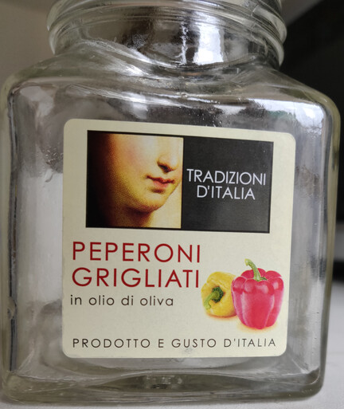

# Crème de poivrons

## Ingrédients

* 1 bocal de poivron (160g égouttés soit environ 280g)
* 1 gousse d'ail
* 3g de sel
* 80g d'huile d'olives (ou saumure si huile d'olive dans la préparation des poivrons).
* 80g d'amandes
* jus d'un citron (15g ?)

## Préparation

Tout mixer dans un hachoir éléctrique jusqu'a la consistance voulue (si
possible faire en sorte de laisser quelques morceaux).

!!! note "Meilleur bocal de poivrons"
    Le meilleur bocal de poivrons que l'on ait trouvé pour l'instant est
    celui-ci 
