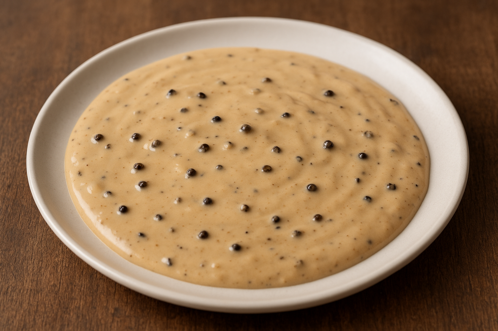

## Ingrédients

* 1 échalotte
* 1 pincée de sel
* 20 g de beurre
* 15 g de poivre en grains
* 100 ml de cognac
* 150 ml de bouillon de volaille
* 1 c. à café de maizena diluée dans 3 c. à café d'eau
* 100 ml de crème fraiche

## Préparation

Épluchez l'échalotte et ciselez-là finement. Torréfiez le poivre et concassez le au pilon.

Faite fondre le beurre dans une casserole et quand il devient noisette, ajoutez les échalottes. Cuire 5 minutes à feu
moyen puis ajoutez le cognac et le bouillon. Faire réduire environ la moité à feu vif puis ajoutez la crème et le
poivre. Mélangez, laissez cuire 2-3 minutes puis ajoutez la Maizena.

Remuez et cuisez jusqu'a obtenir la consistance voulue
